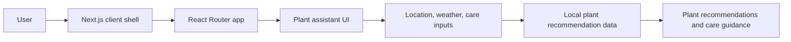

<div align="center">

# GreenGift.AI

### Sustainable gardening. Smarter plant discovery. More meaningful gifting.

GreenGift.AI is a botanical storefront experience for discovering plants,
exploring gardening products, and finding plant recommendations through a guided,
rule-based assistant.


</div>

> **Project status:** The frontend storefront and interaction flows are in active
> development. The backend, persistence, production authentication, and external
> service integrations are scaffolded or planned, not yet verified.

## Product Overview

GreenGift.AI brings plant discovery, sustainable product browsing, and gifting
flows into one calm, mobile-friendly experience. It is designed for people who
want a simpler way to explore plants, choose products for their space, and get
practical care guidance without starting with a dense catalogue.

The current experience includes a storefront UI, role-based login and signup
entry points, English/Hindi language selection, and a guided plant recommendation
assistant. The product is intentionally being built in layers: the interface is
present first, while server-backed commerce and identity capabilities remain on
the roadmap.

## Core Features

| Area | Current experience | Status |
| --- | --- | --- |
| Plant discovery | Home sections, categories, featured product cards, and store browsing UI | Implemented in frontend |
| Recommendation assistant | Guided questions about location, weather, and care commitment, followed by local plant recommendations | Implemented as rule-based UI |
| Sustainable shopping | Store categories and product-focused browsing surfaces for plants, pots, seeds, tools, and fertilizer | Implemented as frontend UI |
| Authentication | User, seller, and admin login/signup screens with manual form flows | UI only; backend not connected |
| Google sign-in | Theme-matched Google button using `NEXT_PUBLIC_GOOGLE_AUTH_URL` | Redirect hook only; OAuth callback is planned |
| Language selection | English/Hindi selector in the navigation | Implemented as UI state |
| Chatbot interaction | Plant care Q&A for watering, soil, pests, yellow leaves, and fertilizer | Local response database; no AI provider connected |
| API layer | Next.js products route placeholder | Placeholder |
| Commerce backend | Express project structure and service folders | Planned |

### What is planned

The following capabilities are not presented as complete because the repository
does not yet contain their working implementation:

- Server-backed product, user, order, and seller APIs
- Database persistence and real cart/order state
- Password authentication, sessions/tokens, protected routes, and logout
- Google OAuth callback and account linking
- Payment processing and transactional checkout
- Provider-backed AI recommendations or chatbot responses
- Production deployment and monitoring

## Product Preview

The repository currently contains plant assets used by the interface, but no
captured product screenshots or GIFs. A visual screenshot gallery will be added
when stable screen captures are available.

> Screenshots coming soon.

## How It Works

The currently implemented recommendation flow is local and deterministic:



The product browsing and authentication surfaces are also frontend interactions
today. They do not yet call a verified backend API or database.

## Architecture

```text
Browser
  |
  v
Next.js App Router host
  |
  v
Client-only React application
  |
  +--> React Router pages and shared UI
  +--> Local product/recommendation data
  +--> Placeholder Next.js products route
  |
  +--> Express backend scaffold (not wired)
          |
          +--> Planned auth, product, order, seller, and chatbot routes
          +--> Planned database and external services
```

### Frontend

`frontend/src/app/layout.tsx` provides the Next.js root layout. The root page
loads `frontend/src/App.tsx` as a client-only boundary because the current visible
application uses `BrowserRouter`. `frontend/src/routes/AppRoutes.tsx` owns the
client routes, shared navbar/footer, and page shell.

This is a transitional hybrid architecture. New Next.js-owned routes should use
App Router conventions; existing routes inside the client shell should continue
using their current React Router APIs until a deliberate migration is planned.

### Backend

`backend/` contains an Express/CommonJS package with empty folders for routes,
controllers, models, middleware, services, and utilities. Its dependencies point
toward a future REST API with validation, JWT/bcrypt authentication, Mongoose,
uploads, email, payments, Cloudinary, and AI services. None of those integrations
are operational in the current repository.

### Data and state

The current frontend uses local TypeScript data and component state. No database,
global state library, or verified frontend API client is configured.

## Tech Stack

| Layer | Technology | Verified use |
| --- | --- | --- |
| Frontend host | Next.js `16.2.11` | App Router layout and client entrypoint |
| UI runtime | React `19.2.4` | Components and interactive pages |
| Language | TypeScript | Frontend source and configuration |
| Client routing | React Router `7.18.1` | Existing in-browser route shell |
| Styling | Tailwind CSS `4` | Utility styling through PostCSS |
| Motion | Framer Motion | Page and component animations |
| Icons | Lucide React and React Icons | UI and brand iconography |
| Backend package | Express `5.2.1` | Scaffold dependency only |
| Package manager | npm | Separate lockfiles in `frontend/` and `backend/` |
| Database | None configured | Mongoose is a backend dependency for planned work |
| Authentication | None connected | Login/signup UI; Google redirect hook only |
| AI | None connected | Local rule-based recommendation data |
| Deployment | Not configured | No platform or production URL verified |

## Project Structure

```text
.
├── AGENTS.md
├── README.md
├── backend/
│   ├── controllers/          Planned request handlers
│   ├── middleware/           Planned auth, role, error, and upload middleware
│   ├── models/               Planned persistence models
│   ├── routes/               Planned auth, product, order, seller, and chatbot APIs
│   ├── services/             Planned AI, email, and payment services
│   ├── utils/                Planned validation, hashing, and token helpers
│   ├── app.js
│   ├── server.js
│   └── package.json
└── frontend/
    ├── public/               Plant image assets
    ├── src/
    │   ├── app/              Next layout, entrypoint, placeholder API, and pages
    │   ├── components/       Home, layout, product, auth, chatbot, and UI components
    │   ├── lib/              Constants, local data, and utilities
    │   ├── pages/             Client-routed page implementations
    │   ├── routes/            React Router route definitions
    │   └── App.tsx            Client application wrapper
    ├── components.json
    ├── next.config.ts
    ├── package.json
    ├── postcss.config.mjs
    └── tsconfig.json
```

## Getting Started

### Prerequisites

- Node.js compatible with Next.js `16.2.11`
- npm
- Git, if cloning the repository

The repository does not declare a specific Node.js version in `package.json` or
an `.nvmrc` file. Use a current supported Node.js LTS release and confirm local
compatibility with the installed Next.js version.

### Installation

Install each package independently:

```bash
cd frontend
npm install

cd ../backend
npm install
```

### Environment variables

No environment example file is currently included. The frontend recognizes one
optional public variable for the Google redirect hook:

Create `frontend/.env.local` only when a backend OAuth endpoint exists:

```env
NEXT_PUBLIC_GOOGLE_AUTH_URL=http://localhost:5000/api/auth/google
```

This value is a URL, not a credential. Do not place OAuth secrets, JWT secrets,
database credentials, or API keys in the frontend or in this README.

## Run Locally

Start the frontend from `frontend/`:

```bash
cd frontend
npm run dev
```

The Next.js development server uses:

```text
http://localhost:3000
```

Available frontend scripts:

```bash
npm run dev
npm run build
npm run start
```

The backend currently has no working `dev` or `start` script. Its existing test
script is a placeholder and does not execute a test suite.

## Authentication

The frontend exposes separate entry points for users, sellers, and admins. The
user login and registration screens include manual form interactions and a
Google button. Current behavior is UI-level only:

- No password request reaches a backend.
- No account is persisted.
- No session or JWT is issued or verified.
- No protected route or logout flow is connected.
- Google redirects only when `NEXT_PUBLIC_GOOGLE_AUTH_URL` is configured.

Real authentication is a roadmap item and must be implemented server-side before
the UI is described as production-ready.

## AI and Recommendations

There is no external AI provider configured. The plant assistant uses an in-code
recommendation table and a small local Q&A map. It collects placement, weather,
and care-preference choices, then selects matching plants and displays care text.

The backend contains an empty `ai.service.js` placeholder for future work. Any
provider-backed assistant should be documented only after its API, secrets,
failure behavior, and validation are implemented and tested.

## Product Philosophy

GreenGift.AI is built around a simple idea: gardening products should feel easier
to discover, more personal to choose, and more meaningful to give. The interface
keeps the first interaction approachable while leaving room for richer,
server-backed recommendations and sustainable commerce workflows over time.

## Roadmap

### Completed in the current frontend

- [x] Responsive GreenGift storefront shell
- [x] Home, store, about, contact, login, and signup UI routes
- [x] Product/category presentation components
- [x] Rule-based plant recommendation assistant
- [x] Local plant-care Q&A responses
- [x] Theme-matched manual and Google auth entry buttons
- [x] English/Hindi navigation selector UI

### In progress

- [ ] Stabilize the hybrid Next.js and client-router experience
- [ ] Replace placeholder product data/API responses with a defined contract

### Planned

- [ ] Implement the Express server and REST route contracts
- [ ] Add database persistence for users, products, carts, and orders
- [ ] Connect secure manual authentication and Google OAuth
- [ ] Add real checkout and payment processing
- [ ] Connect a provider-backed AI assistant where it adds value
- [ ] Add automated tests, linting, observability, and deployment configuration
- [ ] Add verified screenshots and a production deployment

## Testing and Quality

The repository currently provides build scripts but no frontend lint or automated
test script. The backend `npm test` command is the default placeholder from its
package manifest and is not meaningful verification.

Before treating a change as verified:

1. Run the narrowest relevant check for the touched code.
2. Run `npm run build` from `frontend/` for meaningful frontend changes.
3. Manually check affected routes and responsive states when changing UI.
4. Report failures and unverified integrations instead of masking them.

## Deployment

No deployment platform, production URL, CI workflow, or hosting configuration is
present in the repository. Deployment is therefore **not verified**. Add platform
and environment documentation only after a real deployment has been exercised.

## Security Notes

- Keep secrets in ignored environment files or the deployment secret manager.
- Never commit `.env.local`, OAuth secrets, JWT secrets, database credentials, or
  payment keys.
- Treat the current auth and checkout screens as untrusted UI until server-side
  validation and authorization are implemented.
- Add input validation, CORS policy, rate limiting, secure cookies/tokens, and
  error handling when the backend becomes operational.

## Contributing

1. Read [AGENTS.md](./AGENTS.md) and the more specific
   [frontend/AGENTS.md](./frontend/AGENTS.md) before making changes.
2. Inspect the existing implementation and preserve unrelated user work.
3. Create a focused branch for your change.
4. Reuse existing components and dependencies where possible.
5. Run the relevant validation commands from the owning package directory.
6. Describe what is implemented, tested, verified, or still blocked in the pull request.

There is no pull-request template or contribution policy in the repository yet.

## Development Progress

No `docs/DEVELOPMENT_LOG.md` exists yet. Day-by-day history will be linked here
when the project begins maintaining that file.

## License

License has not yet been specified in the repository.

## Repository Notes

- No live demo URL or public GitHub repository URL is configured in the project.
- No production deployment claim is made here.
- No screenshots are included because the repository currently contains plant
  assets, not captured product screens.
